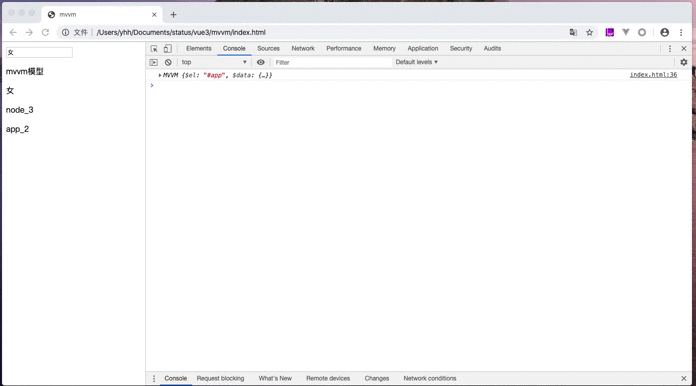

# mvvm

mvvm 简单实现

## 基本思路


> 数据劫持<br>
> 编译模板<br>
> 数据监听<br>
> 发布订阅<br>

#### 初始化 MVVM 对象，html 模板

```html
<!DOCTYPE html>
<html lang="en">
  <head>
    <meta charset="UTF-8" />
    <meta name="viewport" content="width=device-width, initial-scale=1.0" />
    <meta http-equiv="X-UA-Compatible" content="ie=edge" />
    <title>mvvm</title>
  </head>
  <body>
    <div id="app">
      <input type="text" v-model="sex.mal" />
      <p class="class_node_1" title="node_node_1">{{ name }}</p>
      <p class="node_2">{{ sex.mal }}</p>
      <p class="node_3">node_3</p>
      app_2
      <div class="div_1"></div>
    </div>
    <script src="./js/dep.js"></script>
    <script src="./js/watcher.js"></script>
    <script src="./util/index.js"></script>
    <script src="./js/observer.js"></script>
    <script src="./js/compile.js"></script>
    <script src="./js/index.js"></script>
    <script>
      var vm = new MVVM({
        el: '#app',
        data: {
          name: 'mvvm模型',
          age: 30,
          sex: {
            mal: '女',
            faml: '男'
          }
        }
      });
      console.log(vm);
    </script>
  </body>
</html>
```

```javascript
class MVVM {
  constructor(options) {
    this.$el = options.el;
    this.$data = options.data;
    new Observer(this.$data);
    new Compile(this.$el, this);
  }
}
```

#### 数据劫持函数编写

使用 Object.defineProperty 对传入的 othions 上面的每个对象的属性进行劫持，新增属性重新也需要对新的属性进行拦截(set 函数里面拦截新的属性)

```javascript
// observer.js
class Observer {
  constructor(data) {
    this.observe(data);
  }
  observe(data) {
    // 对每个key值进行拦截
    if (!data || typeof data !== 'object') return;
    Object.keys(data).forEach(key => {
      this.defineReactive(data, key, data[key]);
      this.observe(data[key]); // 递归对data下面的所有对象的key都做遍历
    });
  }
  defineReactive(obj, key, value) {
    let _this = this;
    // let dep = new Dep();
    Object.defineProperty(obj, key, {
      enumerable: true, // 是否可遍历
      configurable: true, // 是否可以删除
      get() {
        // Dep.target && dep.addSub(Dep.target);
        return value;
      },
      set(newVal) {
        console.log('newVal', newVal);
        if (newVal !== value) {
          _this.observe(newVal); // 重新赋值如果是对象进行深度劫持
          value = newVal;
          // dep.notify(); // 通知所有人数据更新了
        }
      }
    });
  }
}
```

### 编译模板函数编写

编译模板函数主要对 html 中#app 下面的原始标签进行编译

```javascript
// compile.js
class Compile {
  constructor(el, vm) {
    this.el = this.isElementNode(el) ? el : document.querySelector(el); // 选中dom
    this.vm = vm; // vm实例 => MVVM

    if (this.el) {
      let fragment = this.nodeToFragment(this.el);
      this.compile(fragment); // 处理变化的标签
      this.el.appendChild(fragment);
    }
  }
  isElementNode(node) {
    // 判断node是否是标签 例如div、p...
    return node.nodeType === 1;
  }
  isDirective(attrName) {
    // 判断属性名称是否包含v-
    return attrName.includes('v-');
  }
  nodeToFragment(el) {
    // 将标签存储到内存中
    let fragment = document.createDocumentFragment(); // 创建一个空的fragment存储空间
    while (el.firstChild) {
      fragment.appendChild(el.firstChild);
    }
    return fragment;
  }
  compile(fragment) {
    // 解析内存中的fragment
    let childNodes = fragment.childNodes; // 获取el下面的所有标签
    Array.from(childNodes).forEach(node => {
      if (this.isElementNode(node)) {
        // 是node标签
        this.compileElement(node);
        this.compile(node);
      } else {
        this.compileText(node);
      }
    });
  }
  compileElement(node) {
    // 编译标签
    let attrs = node.attributes; // 获取标签上面的属性
    Array.from(attrs).forEach(attr => {
      let attrName = attr.name; // 获取标签的名字
      if (this.isDirective(attrName)) {
        let attrValue = attr.value; // 获取属性对应的值
        let [, type] = attrName.split('-'); // 获取v-指令，对应指令的类型 type = model || type = on ...
        CompileUtil[type](node, this.vm, attrValue);
      }
    });
  }
  compileText(node) {
    // 编译文本
    let text = node.textContent; // 获取文本节点内容

    // 创建匹配 {{}} 的正则表达式
    let reg = /\{\{([^}]+)\}\}/g; // 贪婪匹配
    if (reg.test(text)) {
      // 如果存在{{}}
      CompileUtil.text(node, this.vm, text);
    }
  }
}
```

这里需要使用一些辅助函数 util/index.js,主要对 dom 标签中绑定的变量和 data 中定义的变量进行绑定和转换

```javascript
// util/index.js
let CompileUtil = {
  updated: {
    updataText(node, value) {
      // 文本节点更新内容
      node.textContent = value;
    },
    modelUpdater(node, value) {
      // 输入框更新内容
      node.value = value;
    }
  },
  formateData(vm, valKey) {
    // 格式化data中的数据 valKey为data中的key
    let keyArr = valKey.search('.') == -1 ? [valKey] : valKey.split('.'); // 存储匹配的属性的key['people','name']
    // 获取对应属性的值
    return keyArr.reduce((fatherKey, childKey) => {
      // 父亲的key,子类的key 返回最终key对应的值
      return fatherKey[childKey];
    }, vm.$data);
  },
  getTextInData(vm, value) {
    // 在data中获取对应变量的值
    return value.replace(/\{\{([^}]+)\}\}/g, (...args) => {
      return this.formateData(vm, args[1].trim()); // trim去掉变量前后的空格 => people.name
    });
  },
  setData(vm, valKey, newValue) {
    let dataArr = vm.$data;
    // 设置data中的值
    keyArr = valKey.search('.') == -1 ? [valKey] : valKey.split('.');
    return keyArr.reduce((oldVal, newVal, index) => {
      if (keyArr.length - 1 <= index) {
        return (dataArr[oldVal][newVal] = newValue);
      }
      return dataArr[oldVal][newVal];
    });
  },
  model(node, vm, value) {
    // value 对应变量中的key
    // reg为匹配后的变量名称
    let update = this.updated.modelUpdater;
    let dataValue = this.formateData(vm, value); // 找到data中对应的值

    // 添加观察者，作用与 text 方法相同
    new Watcher(vm, value, newValue => {
      update && update(node, newValue);
    });

    // v-model 双向数据绑定，对 input 添加事件监听
    node.addEventListener('input', e => {
      // 获取输入的新值
      let newValue = e.target.value;
      // 更新到节点
      this.setData(vm, value, newValue);
    });

    // 第一次设置值
    update && update(node, dataValue);
  },
  text(node, vm, value) {
    // reg为匹配后的变量名称
    let update = this.updated.updataText;
    let dataValue = this.getTextInData(vm, value); // 找到data中对应的值
    // 替换html中变量的值为data中的值
    value.replace(/\{\{([^}]+)\}\}/g, (...args) => {
      // 解析时遇到了模板中需要替换为数据值的变量时，应该添加一个观察者
      // 当变量重新赋值时，调用更新值节点到 Dom 的方法
      new Watcher(vm, args[1].trim(), newValue => {
        // 如果数据发生变化，重新获取新值
        update && update(node, newValue);
      });
    });
    update && update(node, dataValue);
  }
};
```

### 发布订阅函数

将需要更新的数据通过 watcher 的形式存储到一个数组里面，数据发生改变，通知 watcher 更新数据

观察者，用于存储可变的变量中，新的值和旧的值，并通过 updated 函数更新值

```javascript
// watcher.js
class Watcher {
  constructor(vm, key, cb) {
    // key 为页面对应的变量 people.name
    this.vm = vm;
    this.key = key;
    this.cb = cb;
    this.oldValue = this.get();
  }
  get() {
    Dep.target = this;
    let value = CompileUtil.formateData(this.vm, this.key); // 获取data中对应的值
    Dep.target = null;
    return value;
  }
  updated() {
    // 获取新值
    let newValue = CompileUtil.formateData(this.vm, this.key);
    // 获取旧值
    let oldValue = this.oldValue;
    // 如果新值和旧值不相等，就执行 callback 对 dom 进行更新
    if (newValue !== oldValue) {
      this.cb(newValue);
    }
  }
}
```

订阅者函数，发布和订阅 watcher

```javascript
// dep.js
class Dep {
  constructor() {
    this.subs = []; // 存储需要监听的data里面的key
  }
  addSub(watcher) {
    this.subs.push(watcher);
  }
  notify() {
    this.subs.forEach(watcher => watcher.updated());
  }
}
```

打开浏览器

